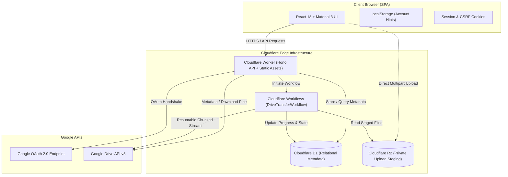
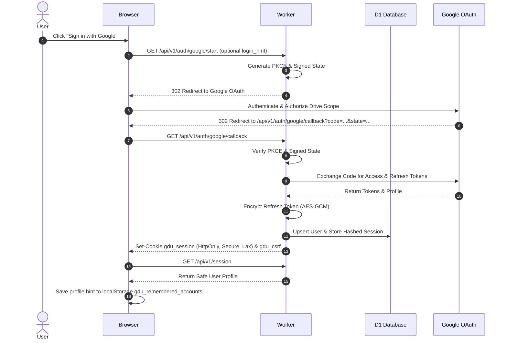
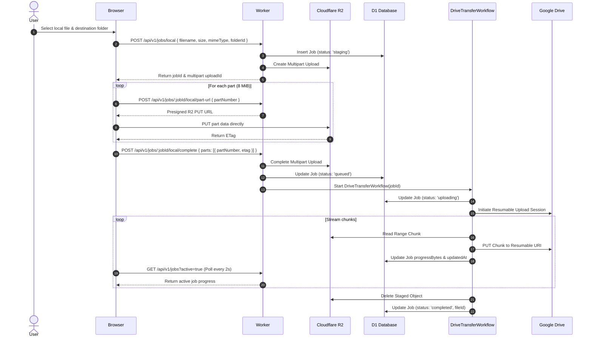
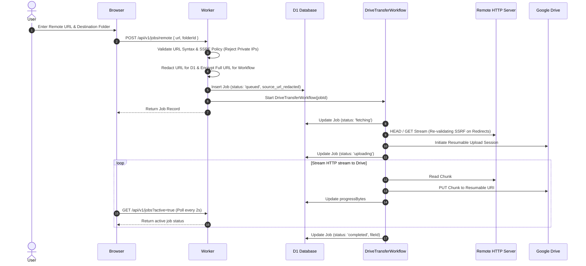
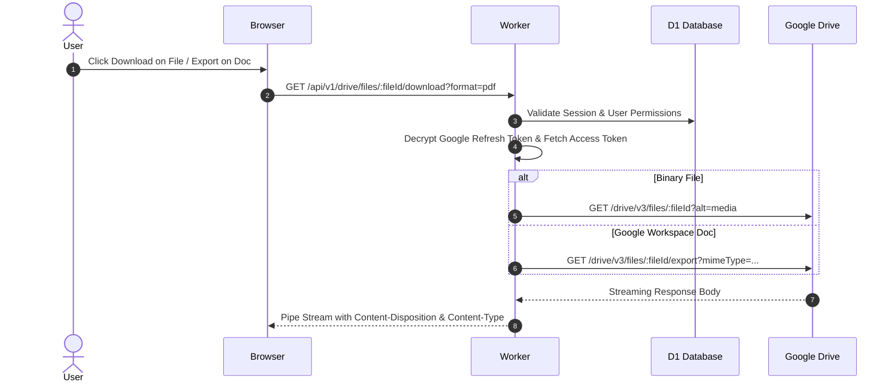
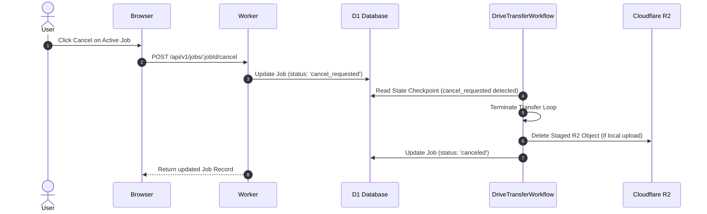
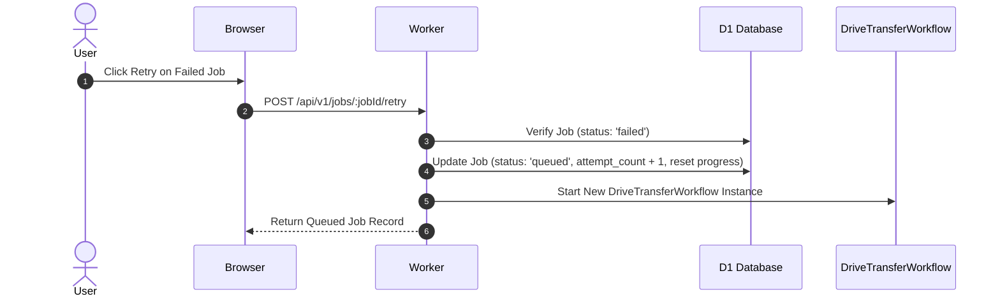

# Architecture Decision Record: Cloudflare Web Migration

- **Status:** Approved
- **Date:** 2026-08-18
- **Target Platform:** Cloudflare Workers, Static Assets, D1, R2, Cloudflare Workflows

---

## 1. Context & Objectives

The Google Drive Uploader application is transitioning from a Chrome Manifest V3 browser extension to a responsive, multi-user web application hosted entirely on Cloudflare's serverless edge infrastructure.

The core objective is to deliver URL-to-Drive and local-file-to-Drive upload capabilities alongside Google Drive management (browsing, sharing, trashing, downloading) without requiring local browser extensions, personal cloud infrastructure (GitHub Actions, Apps Script, Cloud Run), or exposing provider credentials to client-side code.

---

## 2. Product Scope Decisions

### 2.1 Included in Web V1

- **Google Authentication:** Standard OAuth 2.0 Web flow with exactly one active Google Drive account per user session.
- **Remembered Account Chooser:** Client-side remembered account hints (`localStorage.gdu_remembered_accounts`) storing only non-sensitive profile information (email, name, picture, Google sub). Selecting an account triggers a fresh OAuth login flow using `login_hint` and `prompt=select_account`.
- **Upload Capabilities:**
  - Remote URL upload with durable background execution, SSRF validation, and progress tracking.
  - Local file upload staged via direct-to-R2 multipart upload followed by durable Drive transfer.
  - Job management: durable job progress, history, cancellation, and retry.
- **Drive Management:**
  - Navigation: My Drive folder tree, breadcrumbs, search, and "Shared with me" view.
  - File Operations: Folder creation, file renaming, moving, trashing, restoring, permanent deletion, empty trash.
  - Sharing: View, add, update, and remove Google Drive permissions.
  - Downloads & Exports: Binary downloads and Google Workspace document exports (Docs, Sheets, Slides) streamed server-side.
  - Quota: Live Google Drive storage quota display.
- **User Interface & Themes:** Responsive desktop/mobile Material Design 3 UI using existing theme tokens and palettes.
- **Backend Operations:** Server-side user preferences, audit logging, automatic TTL retention cleanup, operational health metrics, and rollback capabilities.

### 2.2 Explicitly Removed from Web V1

- **Chrome-Specific Extension Features:** Context menu upload, arbitrary-tab text selection capture, page-scoped `blob:` URL capture, popup/options entry points, content scripts, extension background service worker, Chrome alarms, and Chrome notifications.
- **Personal Third-Party Infrastructure:** User-configured GitHub Actions workflows, personal Google Apps Scripts, and personal Cloud Run uploaders. Cloudflare Workflows serves as the centralized orchestrator.
- **Client Credential Exposure:** Eliminating any endpoint returning raw Google access/refresh tokens (`GET_VALID_TOKEN`) to browser JavaScript.
- **Cross-Account Simultaneous Sessions:** Single active session model. Switching accounts requires logging out and authenticating with the target Google identity.
- **Legacy Extension Data Migration:** Extension-local storage, tokens, and history are not automatically imported across the security boundary. Users start with clean server-side records.

### 2.3 Deferred Decisions

- **Companion Extension:** A lightweight browser extension for right-click context menu URL capture is deferred until Web V1 achieves complete production feature parity. Any future companion extension will only submit URLs to the authenticated web API and will never handle Google tokens or execute uploads directly.

---

## 3. System Architecture & Component Ownership

### 3.1 One-Origin Deployment

- The React SPA static assets and Hono API routes (`/api/v1/*`) are served from the same canonical domain.
- Authentication relies on `Secure`, `HttpOnly`, `SameSite=Lax` session cookies (`gdu_session`), eliminating cross-origin CORS latency, preflight overhead, and third-party cookie restrictions.
- State-modifying requests require a double-submit CSRF token matching the `gdu_csrf` cookie.

### 3.2 Storage & Runtime Responsibilities

1. **Cloudflare D1 (Relational Database):**
   - Stores user accounts, hashed session tokens, encrypted OAuth refresh tokens, user preferences, durable upload jobs, and audit events.
   - **Strict Rule:** D1 stores metadata only. No raw file contents, base64 payloads, or binary buffers are permitted in D1.
   - All tenant queries strictly include `user_id` to enforce multi-tenant isolation.
2. **Cloudflare R2 (Object Storage):**
   - Private bucket strictly used for staging local file uploads via presigned multipart uploads.
   - Storage keys follow the format: `users/{userId}/jobs/{jobId}/{randomId}`.
   - Objects are deleted immediately upon transfer completion, cancellation, or after a 7-day TTL cleanup cycle.
3. **Cloudflare Workflows (`DriveTransferWorkflow`):**
   - Durable execution engine for background transfers to Google Drive.
   - Handles resumable upload initialization, chunk streaming (8 MiB chunks), retry backoff, and progress checkpoints in D1.
4. **Google Drive API Client:**
   - Server-side only adapter using decrypted Google OAuth tokens.
   - Handles token refresh via `TOKEN_ENCRYPTION_KEY` (AES-256-GCM).

---

## 4. Limits, Constraints & Polling Model

- **Upload Limits:**
  - Maximum upload size per file: 5 GiB.
  - Concurrent active jobs per user: 25.
  - Daily new job quota per user: 100 jobs/day.
- **Polling Model:**
  - Browser polls active jobs via `GET /api/v1/jobs?active=true` every 2 seconds with `ETag` / `If-None-Match` caching.
  - WebSockets and SSE are intentionally avoided in V1 to reduce edge connection overhead.
- **Drive Scope:**
  - Full scope `https://www.googleapis.com/auth/drive` is required to support folder creation, move operations, sharing permissions, and trash manipulation.

---

## 5. Sequence Diagrams

### 5.1 Authentication Flow

### 5.2 Local File Upload Flow

### 5.3 Remote URL Upload Flow

### 5.4 Drive Download & Export Flow

### 5.5 Job Cancellation Flow

### 5.6 Job Retry Flow

---

## 6. Test Accounts & Drive Fixtures Inventory

### 6.1 Dedicated Test Accounts

| Account Role | Identifier | Purpose |
| :--- | :--- | :--- |
| **Primary Account** | `uploader-test-a@example.com` | Primary user for uploads, folder creation, root management, and ownership isolation. |
| **Collaborator Account** | `uploader-test-b@example.com` | Secondary user for sharing permission validation, "Shared with me" testing, and multi-tenant isolation. |

### 6.2 Drive Test Fixtures & Expected Behavior

| Fixture Name | Description | Expected Web Behavior |
| :--- | :--- | :--- |
| **Empty Folder** | Newly created folder with 0 children | Listing returns empty item list; shows empty state UI; allows new uploads and subfolder creation. |
| **Nested Folders** | `Root / Projects / 2026 / Assets` | Correct breadcrumb hierarchy; path traversal; file move operations between hierarchy levels. |
| **Shared Folder** | Folder owned by Account A, shared with Account B (Editor) | Account B can list contents, view metadata, and upload files directly into the shared folder. |
| **Shared-With-Me Item** | Single file created by Account B, shared to Account A | Appears in Account A's "Shared with me" view; downloadable; moving or trashing restricted per permissions. |
| **Trashed Item** | Item moved to Drive trash | Excluded from standard folder listing and search; visible in Trash view; supports restore and permanent delete. |
| **Google Doc/Sheet/Slide** | Native Google Workspace documents | Download triggers export flow with selected MIME conversion (e.g., DOCX/PDF); raw media download handled gracefully. |
| **1 MiB Binary** | 1 MiB arbitrary binary file | Fast upload benchmark; verifies single-chunk upload pipeline and instant completion. |
| **8 MiB Binary** | 8 MiB binary file | Single/multi-chunk boundary benchmark; validates 8 MiB chunk slicing for R2 staging and resumable Drive stream. |
| **100 MiB Binary** | 100 MiB binary file | Large file benchmark; tests multipart upload assembly, durable workflow streaming, and progress reporting. |
| **Cross-Account Fixtures** | Identically named files in Account A and Account B | Verifies tenant isolation; D1 query must strictly filter by `user_id`; Account A cannot inspect or access Account B's records. |

---

## 7. Baseline Verification Record

The following commands were executed against the existing repository baseline before introducing Cloudflare runtime changes:

| Command | Exit Code | Result Summary | Pre-existing Issues / Notes |
| :--- | :---: | :--- | :--- |
| `npm ci` | `0` | **Success** | 399 packages installed and audited cleanly. |
| `npm run type-check` (`tsc --noEmit`) | `0` | **Success** | TypeScript compilation completed with zero errors. |
| `npm run lint` (`eslint src --ext .ts,.tsx`) | `1` | **Pre-existing Errors** | 304 problems (103 errors, 201 warnings) in legacy Chrome extension files (`src/sw.ts`, `src/components/*`, `src/theme/material3Theme.ts`). These will be addressed during staged component migration. |
| `npm run build` (`tsc && vite build`) | `0` | **Success** | Vite built Chrome extension bundles in `dist/` (1037 modules transformed). |
